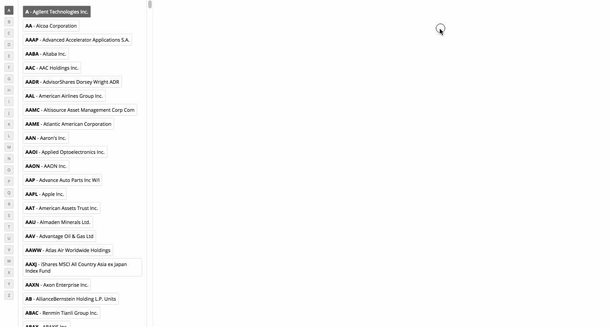

Stock Browser Project
=======
by: Chad Jewsbury

Libraries/Tools used:
* React
* PropTypes (opted for this instead of using TypeScript for quicker startup)
* react-redux
* redux-thunk
* styled-components (for the minimal styling needed)
* Babel w/ ES6/7 presets.
* Webpack w/ minimal custom config (no dist or minification/uglify)
* Yarn
* ESLint (AirBnB config)

WebSocket interactions are handled with a custom (very bare-bones) redux middleware. This could be improved a lot but is functional for this quick project.

My Redux implementation could also be cleaned up a lot. There is a lot of boilerplate that could be simplified up with actionCreator libraries or helper functions and cleaner file organization.

GIF Demo:

Tasks I wish I had more time to do... 
- [ ] Use RxJS for websocket and redux
- [ ] Add Tests
- [ ] Rewrite in Typescript
- [ ] Optimize React rendering (there are a few components that are re-rendering too much due to the way my components are connected and props are being passed down). 
- [ ] Feature: Search for stock
- [ ] Feature: Highlight price/news on updates
- [ ] Feature: Keep history of selected stocks
- [ ] Feature: Favorites / pinned stocks
- [ ] Feature: Responsive design -- It's very desktop focused now.
